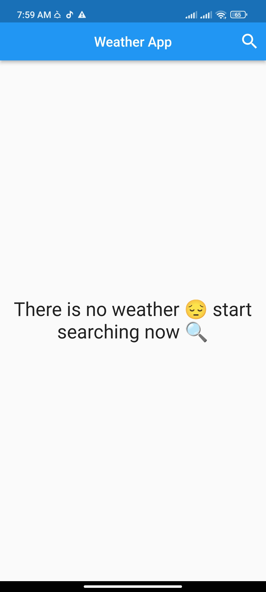
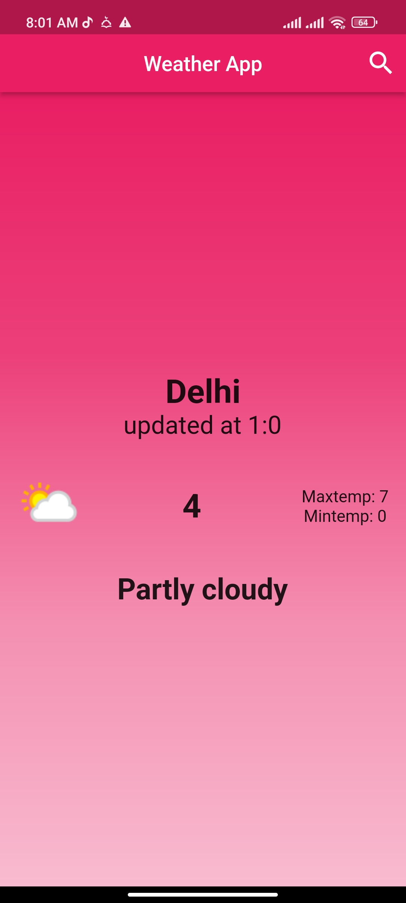
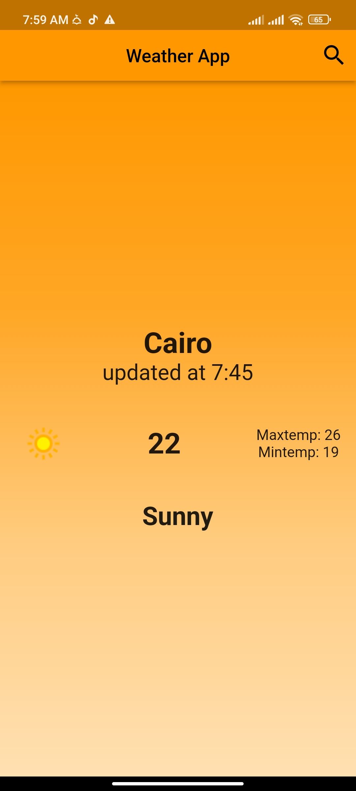
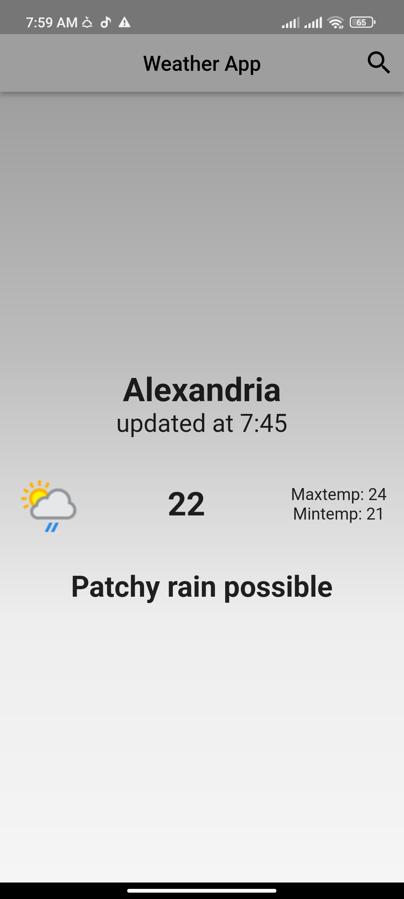

# Weather Application

Real-time weather information provided by us allows users to make informed decisions about outdoor activities, clothing choices, and potential schedule changes.

## Installation

* Download APK
* Install the application

## Screenshots

## Tech Stack

**UI:** Flutter

**State Management:** BLoC

**API:** Using DIO with [Weather Api](https://www.weatherapi.com/)

## Features

- Live previews
- Fullscreen mode
- Cross platform

## License

[MIT](https://choosealicense.com/licenses/mit/)

